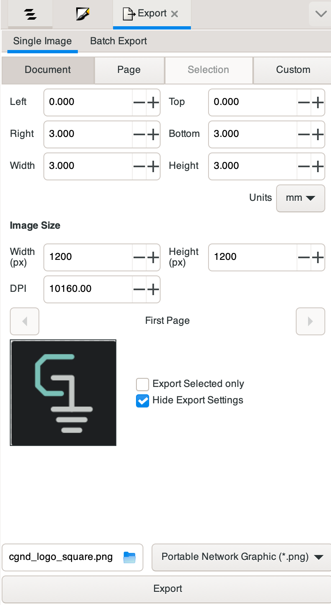
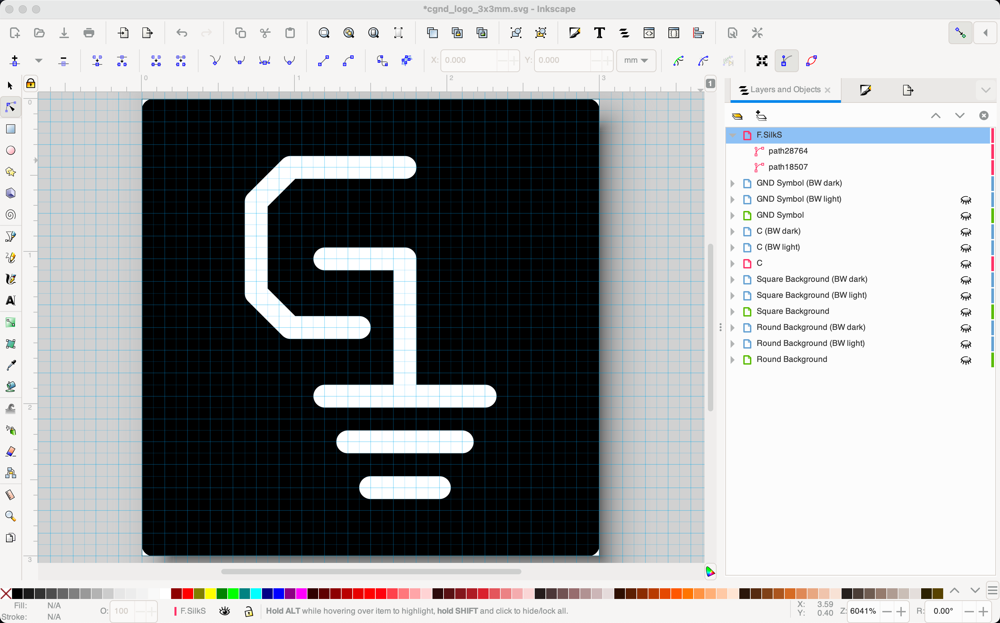
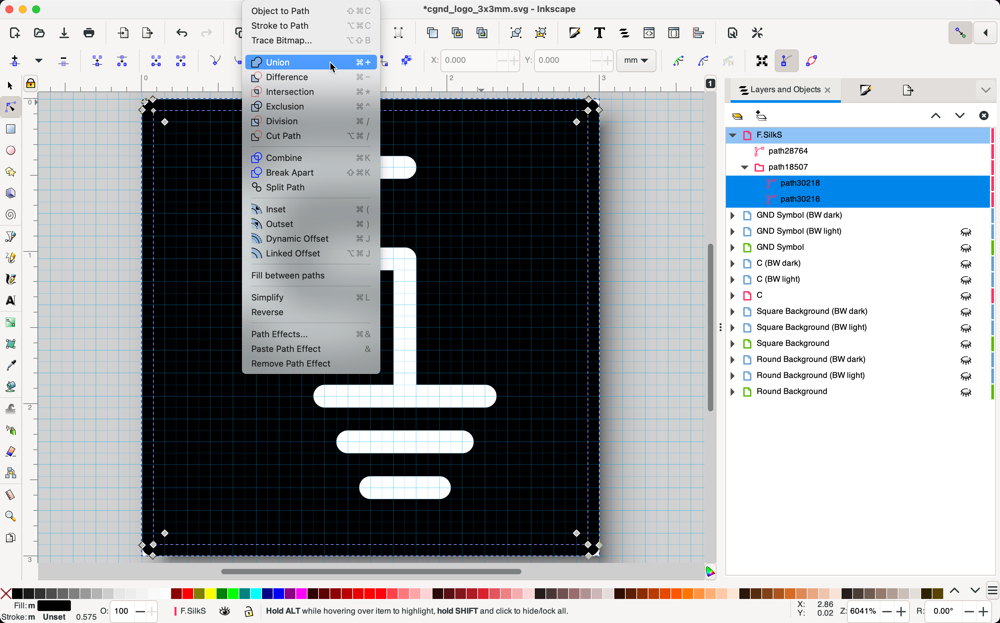
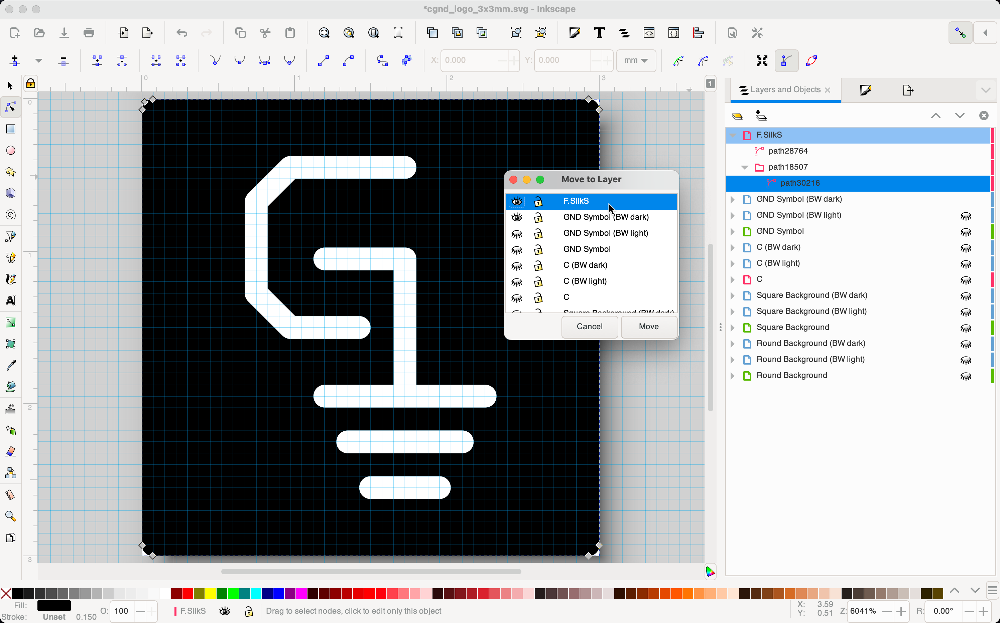
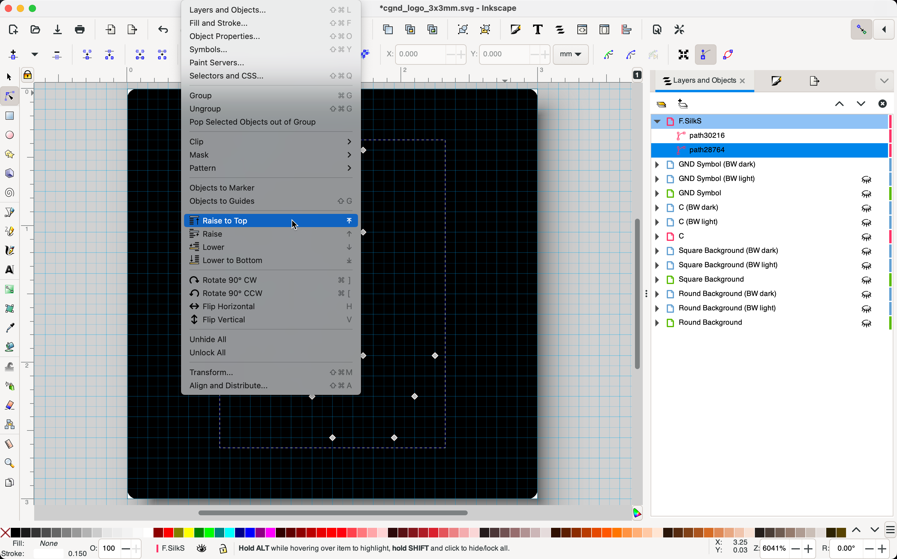
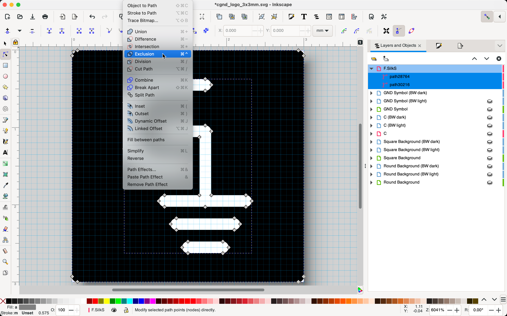
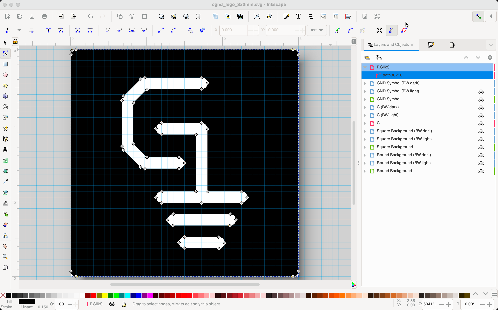
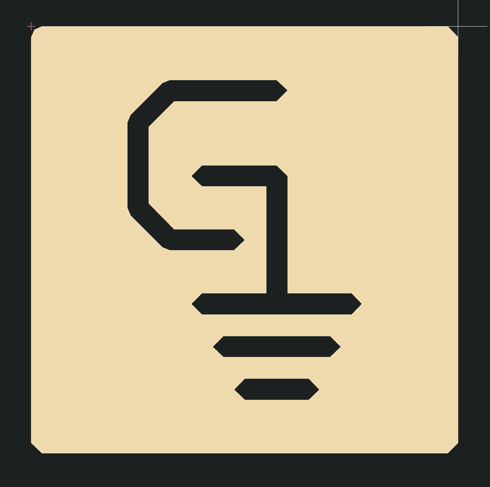

# Common Ground Electronics Logo


## Manufacturing Design Rules

The logo has been designed with the goal of being easily manufacturable with a traditional PCB silkscreen process.  All silkscreen line widths are at least 0.15mm minimum width. Although the logo was designed in Inkscape, the design only uses line primitives so that it can be easily replicated within a PCB layout tool like KiCad if necessary.

### Inkscape Export Settings

The images in this repository are exported as PNG at `1200px` width x `1200px` height with a DPI of `10160`.



## KiCad Logo Footprint

The KiCad logo footprint is generated using [svg2mod](https://github.com/svg2mod/svg2mod). It expects images saved in the uncompressed Inkscape SVG (i.e., not "plain SVG") format. Layers or items must be named to match the target layer in KiCad (e.g. the Inkscape layer name must be `F.SilkS` to create top silkscreen drawings in the KiCad footprint).

### Recreate the KiCad silkscreen layer

The `F.SilkS` layer is manually created from paths in the other layers.  If the logo is changed in the future, this layer needs to be recreated and the KiCad footprint needs to be regenerated.

Create a new layer named `F.SilkS` in Inkscape and copy the paths to this layer:



Select each layer and choose `Path` → `Stroke to Path`:


Select all background paths and choose `Path` → `Union`:



Move the background paths into the `F.SilkS` layer:



Delete the empty subpath folder and move the graphics paths to the top:



Select both paths and choose `Path` → `Exclusion`:



This will result in a single path that's ready for svg2mod conversion:



### Generate footprint

Install svg2mod in an isolated python virtual environment using [pipx](https://pypa.github.io/pipx/):

```bash
pipx install svg2mod
```

Generate the KiCad logo footprint:

```bash
svg2mod --center --precision=0.01 --format=pretty --units=mm --name=REF** --value=LOGO_CGE_3X3MM_SILKSCREEN --input-file=cge_logo_3x3mm.svg --output-file=CGE_LOGO.pretty/LOGO_CGE_3X3MM_SILKSCREEN.kicad_mod
```

**Note:** the default precision (`-p 1`) will result in poor output quality:



Specifying a higher precision `-p 0.01` gives better results:


